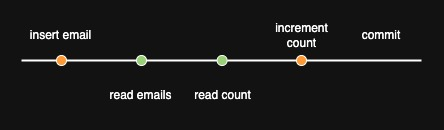
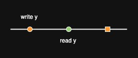
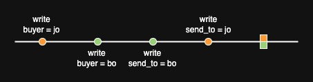
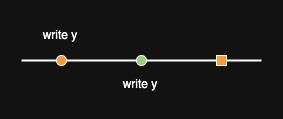
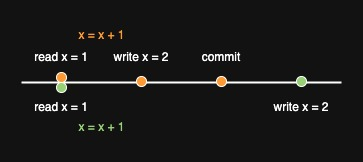
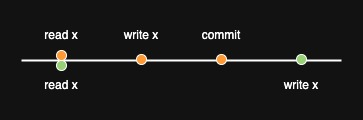

= Concurrent transactions

When two transactions run concurrently against a database, bad things may happen.

Like what?

== Bad things

=== Dirty read

If the transactions are

[source,sql]
insert into emails (body, unread_flag) values ('hi', true);
update count set unread = unread + 1; --- denormalized for speed

and

[source,sql]
select * from emails;
select unread from count;

then the statements might run in this order:

[source,sql]
insert into emails (body, unread_flag) values ('hi', true);
select * from emails;
select unread from count;
update count set count = count + 1;

This is bad: you see the unread email but the counter still says 0.

A picture is clearer:

Generically:

This is a _dirty read_: one transaction's read sees another transaction's uncommitted write.

=== Dirty write

Another example:

This is bad: bo buys it but jo gets it.

Generically:

This is a _dirty write_: one transaction's write clobbers another's uncommitted write.

=== Lost update

This is not a dirty write.
But it's still bad.
Two applications (represented by the orange and green text) tried to increment `x`, and succeeded so far as they can tell, but `x` ends up as 1, not 2.

Generically:

This is a _lost update_: two transactions read an object, applications compute new values for it, and the transactions write and commit in turn.

=== Write skew

This is bad:
the orange transaction confirms it's safe to take off your belt, and does so;
the green transaction confirms it's safe to take off your braces, and does so;
then your trousers fall down.

Generically:

This is known as _write skew_: read-write straddles write.

=== Read skew

This is bad: the orange transaction sees current's debit but not saving's credit.

Generically:

This is known as _read skew_: reads straddle writes.

== Comments

=== The phenomena aren't necessarily bad

Take dirty reads.
Some instances are bad, like the emails example.
Other instances aren't.
For example, if a transaction writes then commits, and another transaction consists of a single read, then it's fine if it reads the write before it's committed.

But a database system can't, or can't easily, prevent just the bad instances.
So it prevents them all.
For example, the database system can't tell in advance whether an uncommitted write will be committed or aborted.

=== Dirty write v. lost update v. write skew

[quote,Martin Kleppmann,Designing Data-Intensive Applications]
Write skew can occur if two transactions read the same objects, and then update some of those objects (different transactions may update different objects). In the special case where the transactions update the same object, you get a dirty write or lost update anomaly (depending on the timing).
